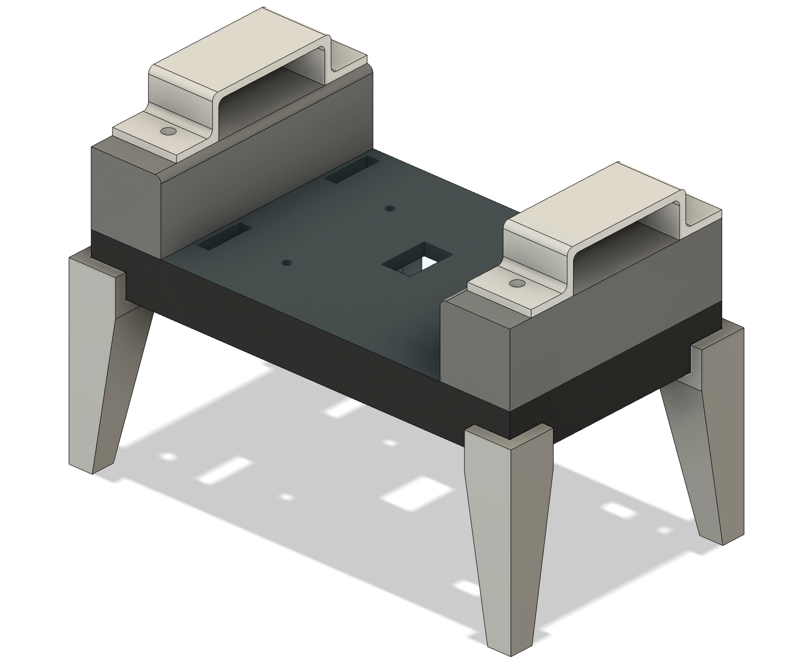
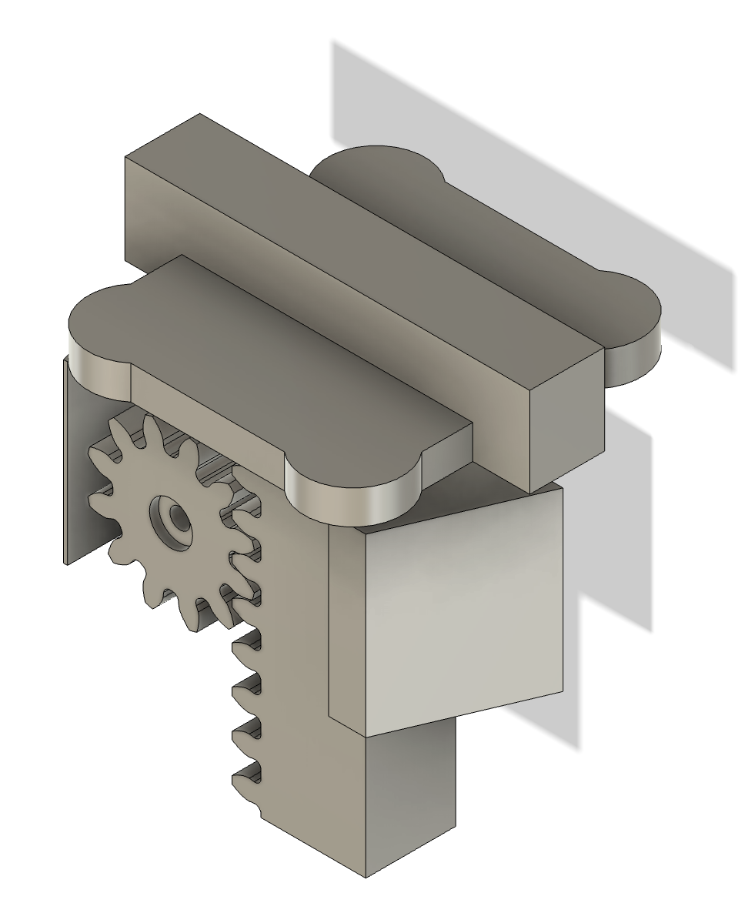
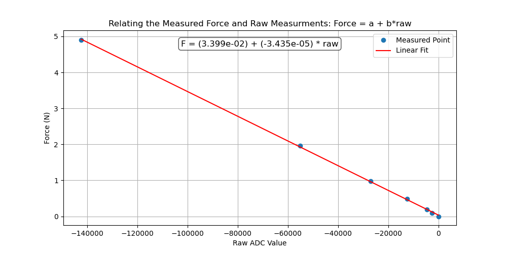
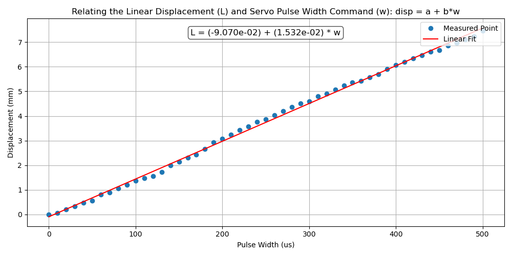
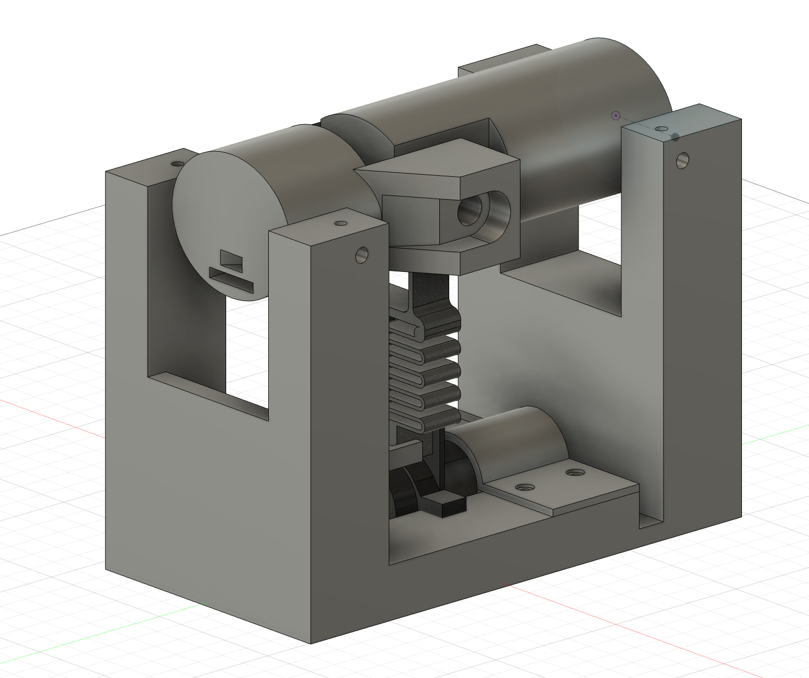
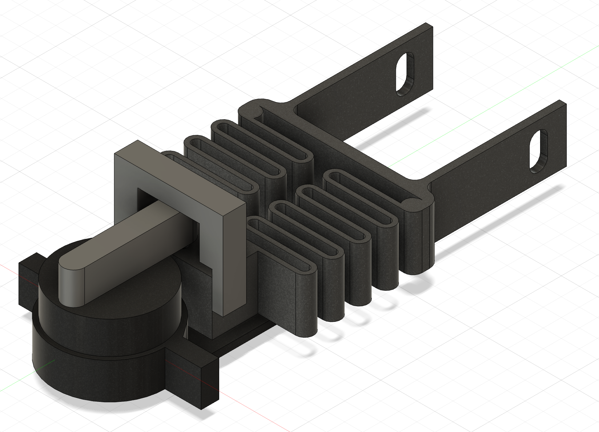
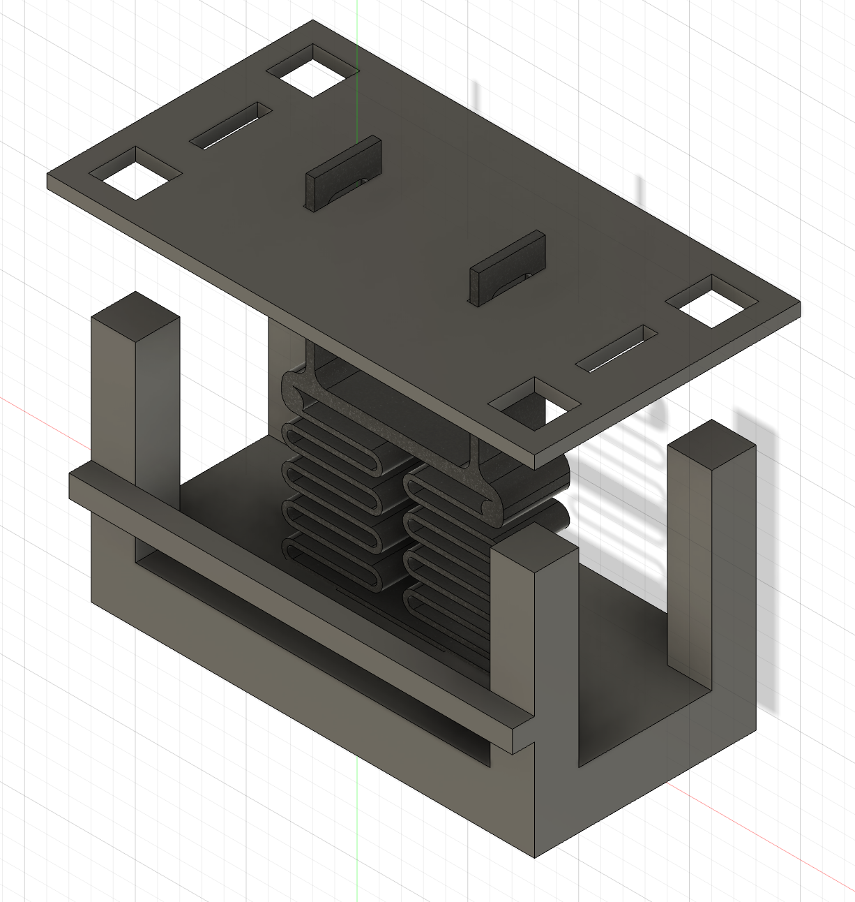
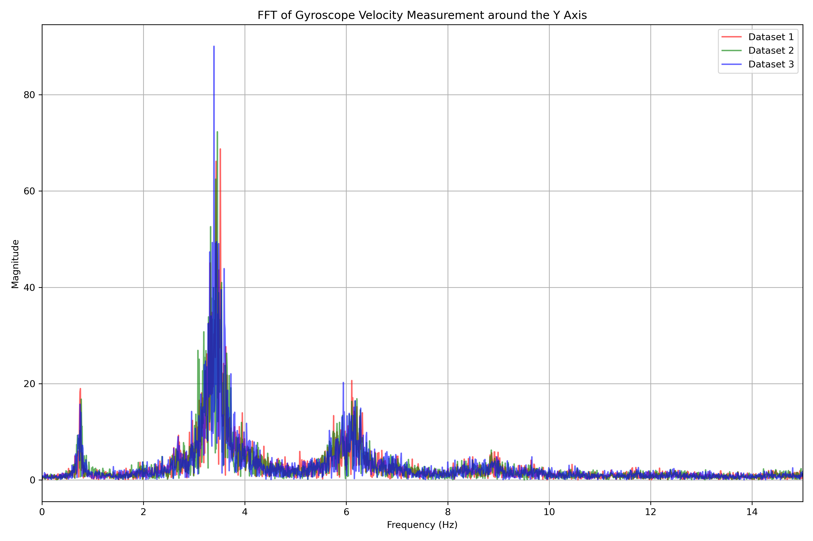

# Tremor Suppression Assessment
This repository includes the instructions to build simple and affordable devices to test wrist exoskeletons for tremor suppression, which includes:
1 - a three-point bending machine to measure the stiffness,
2 - and an oscillatory wrist joint to simulate wrist tremor.
## 1 - Three Point Bending Device
This device was designs to assess the stiffness of a small exoskeleton. A linear displacement is applied on the exoskeleton by means of a servo motor and rack-and-pinion gearbox, and a load-cell is attached to the end effector to measure the applied force. 

|  |  |
| :-----------------------------------------------: | :--------------------------------------------------------: |
|             **Figure 1:** Base setup              |               **Figure 2:** Load cell setup                |

The device consists of two main components:
- a base (Figure 1)
- an end effector (Figure 2)

The base was designed to securely hold the sample during testing and to mount the servo motor in the appropriate position. Its modular design allows stiffness measurements at different points of the exoskeleton. The end effector is actuated by an MG996R servo motor, where its angular displacement is converted into a linear displacement by means of a spur-to-linear gearbox. The tip of the end effector distributes the applied force equally onto four load cells encapsulated in a 3D-printed cap. These load cells are arranged in a Wheatstone bridge configuration, enabling precise measurement of small resistance changes, which are caused by mechanical deformation under load. 

The Wheatstone bridge converts resistance variations into a differential voltage signal in the millivolt range. To process this signal, the HX711 analog-to-digital converter (ADC) was used to amplify, filter, and digitise the output. The HX711 is a precision 24-bit ADC that is widely used in weighing scales and industrial control, designed specifically to interface with Wheatstone bridge sensors. It communicates with microcontrollers using a custom two-wire serial protocol (DT and SCK), accessible via the HX711\_ADC library. The HX711 continuously samples the signal and holds the converted data until clocked by the microcontroller, operating at a rate of $10~\mathrm{Hz}$.

### Tools and Components
- FDM 3D Printer (Flashforge 5M Adventurer was used)
- Caliber
- [MG996R Servo Motor](https://www.amazon.co.uk/Pzsmocn-Degrees-Helicopters-Robotic-Various/dp/B0CLGWKP3L/ref=sr_1_7?crid=2HTHPGAJ56Y6U&dib=eyJ2IjoiMSJ9.wogc4i2BFmTbbp_1KzUuA4kjO1IvbSnwEaeE4fUBs91m2Kxkljl7Gbayk552s1KByzJUdnbsghUo5_gd1sdZrULkUjtG6UXABx_IxFpicO-uQWcX5_VTm32dgz2BkLXvxuA14cW1wh0_4t-dmxXxa7OfmbNNnjPDXTDJ-t9xG873xbnqu7wY6JP6vZUN2P8INuiDiu57QHEsjP021zp0o9H9o6Igb4kDpZX3XIvhaG3LGmFQNnW7mmIch3pHO8D3ZLJ-1a-PGwNV_9ktzsRNQ9uoW8n37bhnylQkFCU67k8.gYzW6-Sh9fmm2UNK9i2hZv0QaoHroCeRyJPWE6vCacc&dib_tag=se&keywords=MG996R+Servo+Motor&qid=1773281587&sprefix=mg996r+servo+motor%2Caps%2C275&sr=8-7)
- [Four Strain-Gauge Sensors and HX711 Module](https://www.amazon.co.uk/YOUMILE-110lbs-Half-bridge-Weight-Resistance/dp/B07TWLP3X8)  

### Force Calibration

The HX711 ADC returns a unitless raw value $r$ that is proportional to the applied force $F$. Therefore, to determine the linear mapping parameters between the HX711 measurements and the applied force, a set of calibration masses in the range of $m \in [10,500]g$ were used. Assuming a gravitational acceleration of $g = 9.81~\mathrm{m/s^2}$, these masses correspond to an applied force of $F \in [0.0981,4.905] N$. The linear mapping is achieved by determining the parameters in linear equation
$$F = a + b \cdot r$$
where $F$ is the applied force in newtons, $r$ is the unit-less output from the HX711, and $a$, $b$ are the regression coefficients determined from the calibration data.

Given the calibration data vectors for applied force $\mathbf{F} = [F_1, F_2, \ldots, F_n]$ and corresponding raw sensor readings $\mathbf{r} = [r_1, r_2, \ldots, r_n]$, the linear model coefficient $\{a,b\}$ can be found using least squares method

$$
\boldsymbol{\theta} =
\begin{bmatrix}
a \\
b
\end{bmatrix}
= (\mathbf{X}^\top \mathbf{X})^{-1} \mathbf{X}^\top \mathbf{F},
\qquad
\mathbf{X} =
\begin{bmatrix}
1 & r_1 \\
1 & r_2 \\
\vdots & \vdots \\
1 & r_n
\end{bmatrix},
\qquad
\mathbf{F} =
\begin{bmatrix}
F_1 \\
F_2 \\
\vdots \\
F_n
\end{bmatrix}.
$$

where $\mathbf{X}$ is the $n \times 2$ matrix with a column of ones and a column of $r$ values, and $\mathbf{F}$ is the $n \times 1$ vector of measured forces. 

The calibration parameters $a$ and $b$ were found and used to fit the linear line, as shown in Figure 3.

|                                                                                                       |
| :-----------------------------------------------------------------------------------------------------------------------------------------------: |
| **Figure 3:** Linear regression results for loadcell calibration, relating applied force (N) with the raw HX711 sensor output values (unit-less). |

### Displacement Mapping
The base servo motor receives its commands as pulse-widths $w$ in microseconds, controlled using the `ServoTimer2.h` library.  The corresponding servo rotation is converted to linear displacement through a spur-to-linear gear mechanism, shown in Figure 2.

To identify the relationship between the servo command $w$ and the resulting linear displacement $L$, the servo was actuated with commands in the range  $w \in [1000,2000] \mu s$ and a caliper was used to measure the corresponding loadcell displacement $L$.
A linear regression model is used to determine the mapping:

$$
L = c + d \cdot w
\tag{1}
$$

where \( L \) is the linear displacement in millimeters, \( w \) is the servo pulse-width command, and \( c \), \( d \) are the regression coefficients.

Given the calibration data vectors  
$\mathbf{L} = [L_1, L_2, \ldots, L_n]$ and  
$\mathbf{w} = [w_1, w_2, \ldots, w_n]$,  
the coefficients \(nc \) and \( d \) can be found using the least squares method:

$$
\mathbf{M}\,\boldsymbol{\delta} = \mathbf{L}, \qquad
\mathbf{M} =
\begin{bmatrix}
1 & w_1 \\
1 & w_2 \\
\vdots & \vdots \\
1 & w_n
\end{bmatrix}, \qquad
\boldsymbol{\delta} =
\begin{bmatrix}
c \\
d
\end{bmatrix}.
$$

The least–squares estimate is then given by:

$$
\boldsymbol{\delta}
= (\mathbf{M}^\top \mathbf{M})^{-1} \mathbf{M}^\top \mathbf{L}.
$$

The calibration parameters were found as $\mathbf{\delta} = [c, d]^T = [-0.0907, 0.01532]$, which achieved a good approximation of the linear mapping, as shown in Figure 4. A small sinusoidal error is observed, likely caused by the large teeth of the 3D-printed spur-to-linear gear. Using machined gears with finer teeth may improve the fit.

|                                                                                                                |
| :--------------------------------------------------------------------------------------------------------------------------------------------------------------: |
| **Figure 4:** Linear regression results for loadcell calibration, relating the servo motor pulse width commands (us) with the measured linear displacement (mm). |

## 2 - Tremor Simulation Device
This device was designed to simulate wrist tremor oscillations in one direction (flexion/extension). The full setup is shown in Figure 5. The device consists of one joint and two links, which represent the wrist joint, hand link and forearm link, respectively. The two links are held onto the base using a low-friction metal rods to allow for free rotations. A third rod connects the two links with a potentiometer to measure the relative displacement between the links, and this constitutes the wrist revolute joint. 

The potentiometer wires are passed through a the hand link by a tunnel. A slot for for an IMU is also included as an alternative sensing method. The wrist oscillations are generated by a DC motor, that is attached to the joint through a damped crank-slider mechanism. The crank slider converts the DC motor's revolutions to continous linear oscillations, and the damper spring allows for applying adequate force without damaging the exoskeleton that is being tested. 

|                                                                                                                |
| :--------------------------------------------------------------------------------------------------------------------------------------------------------------: |
| **Figure 5:** Tremor simulation device based on a damped crank-slider mechanism.|

### Tools and Components
- FDM 3D Printer (Flashforge 5M Adventurer was used)
- Caliber
- [DC motor with encoder](https://www.amazon.co.uk/Encoder-Gearbox-Reduction-Printers-Appliances/dp/B0GHFC8SPX/ref=sr_1_7?crid=3V12ZS7TYG7AQ&dib=eyJ2IjoiMSJ9.7ChXReGpV1Nz44734jPg72fY27dGEebMtGKmID6q4tHF-ybAWUQiLKophUnmO6xaE8Odwf85EIeip2Z2Ta07CcbffWimP2jFhUvrIJzVFroKgLPe6Z3v5fZHRm0GMMBSSwW3dRvMb7-RTptFflYydVa3BmaKu4NundIq42PIp3oWsfAitPF1EB3ug1SjrQTBXawe3bPCh8GcR_7z76fNwEkvn_7yYOsjCaHmWsqNFnxCAhSvb4T5rWJDTMY4pnCtUVQ3Rb9dH6Bkdi9t24qbHHK7UgELdkrw6lCOF0QgLp0.07acgIfQMGG2HAmeuMBrhvIYHRRICPvuZu-aOuTeLEI&dib_tag=se&keywords=Motor%2Bwith%2Bencoder%2B500%2BRPM&qid=1773527476&s=industrial&sprefix=motor%2Bwith%2Bencoder%2B500%2Brpm%2Cindustrial%2C290&sr=1-7&th=1) - choose motor with speed $\geq 180\,RPM$ after the reduction gearbox to simulate tremors of $\geq 3\,Hz$
- [Linear Potentiometer](https://www.amazon.co.uk/sourcing-map-Potentiometer-Single-Joint-JST-XH2-54/dp/B0F541XBYS/ref=sr_1_3_sspa?crid=GO473GHNYHN7&dib=eyJ2IjoiMSJ9.36QS7f7mTLfc2EXUiJEjk2_03l96p6q2KTj8MExBfrt02WOEm0LIkeNdiX64VXGGgYRrczsgifo2LjRuoeC3wWQJYy_-OwD9dHoF_MSdg6TM-cvQ6x8rdJ2f2vcY13mXaV-QA47BPjJkFTJzDsg7dKky8gG-0JVVLBcMUV2yZ0aix0ewW1kA79j7AbHd7fe0bHHaNVfoe_iwGyBlFCjkaFRmkLQ173ss9f4_ouIL7lcqeQ7j-48KqIjvxjXevH6I1Gh4BACCJdXhD8XEiFiYkoj-p_27R5DdVEg7QorXybc.whbxCKtb6a3vi67STffZVnArv6aEkiIXtedr5TvCa_E&dib_tag=se&keywords=Potentiometer%2Blinear&qid=1773593112&s=industrial&sprefix=potentiometer%2Blinear%2Cindustrial%2C296&sr=1-3-spons&aref=FcJdqy4bR3&sp_csd=d2lkZ2V0TmFtZT1zcF9hdGY&th=1)
- [IMU (MPU-6050)](https://www.amazon.co.uk/DollaTek-MPU-6050-mpu6050-Accelerometer-Arduino/dp/B07DJ4KMBF/ref=sr_1_4?crid=1WY24H8DKXBQK&dib=eyJ2IjoiMSJ9.AD3UVa4HQO0WjS3ZhZH_5vV_VdPCvc0ooA5QOkKDe39mLr0-LOH6r8rKYomtgEaCsg4i6xuScg7fCcr-su8IpTQxrYjvAbkZORndBr0_Fm8iJUvU31fKqIEtZDEMtBvV5T2zZ6xqSd44wllI03aIXcUB77-BE4n8vk2ZPHPIqS8CFGj-66HkgePCm4SkgQpDN-uNDxgtYWs_8H_Vk0qrsswj-GsLMnh4mWE5jXC96JbP72jfiI06Pf6RyfLGSnQKhUnO1KbB5456WHse8h77VcZoZ-VUw25vdOOLLR6Jldg.X0WeZ-Pe0cXJgKEocWoAWz1JN0zH_ntxPH_qgJSFrPI&dib_tag=se&keywords=IMU&qid=1773281448&sprefix=imu%2Caps%2C262&sr=8-4) - Optional

### Damped Crank Slider

The damped crank slider mechanism is shown in Figure 6. The crank slider converts the rotatory motion of the DC motor to linear oscillations, while the spring is used to damp the oscillations and allows for adequate force to be applied without damaging the exoskeleton. 

|                                                                                                                |
| :--------------------------------------------------------------------------------------------------------------------------------------------------------------: |
| **Figure 6:** A DC-motor-driven damped crank-slider mechanism. |

#### Calibrating Spring Stiffness
To calibrate the spring stiffness to a value within the operating range of the variable stiffness exoskeleton, the spring stiffness must first be measured. 

The table in Figure 7 is used. The spring is attached between the base and the table suface, and some known calibration weights are places on the table surface. A caliber is used to measure the linear displacement of the spring, and the spring stiffness is found by calculating the gradient of the Force/Displacement graph.

$$
K = \frac{(F_2 - F_1)}{(x_2 - x_1)} = g\frac{(m_2 - m_1)}{(x_2 - x_1)}
$$

where $F_2$ and $F_1$ are two samples of linear force applied on the spring, which are equal to $g\,m_2$ and $g\,m_1$, respectively, while $x_2$ and $x_1$ are displacements corresponds to the applied linear forces. 

|                                                                                                                |
| :--------------------------------------------------------------------------------------------------------------------------------------------------------------: |
| **Figure 7:** A stiffness measurement table. |

The spring stiffness can be increased to apply higher force by increasing the wire thickness, reducing its width, or reducing the number of loops. 

### Constant Oscillations
The encoder attached to the [DC motor](https://www.amazon.co.uk/Encoder-Gearbox-Reduction-Printers-Appliances/dp/B0GHFC8SPX/ref=sr_1_7?crid=3V12ZS7TYG7AQ&dib=eyJ2IjoiMSJ9.7ChXReGpV1Nz44734jPg72fY27dGEebMtGKmID6q4tHF-ybAWUQiLKophUnmO6xaE8Odwf85EIeip2Z2Ta07CcbffWimP2jFhUvrIJzVFroKgLPe6Z3v5fZHRm0GMMBSSwW3dRvMb7-RTptFflYydVa3BmaKu4NundIq42PIp3oWsfAitPF1EB3ug1SjrQTBXawe3bPCh8GcR_7z76fNwEkvn_7yYOsjCaHmWsqNFnxCAhSvb4T5rWJDTMY4pnCtUVQ3Rb9dH6Bkdi9t24qbHHK7UgELdkrw6lCOF0QgLp0.07acgIfQMGG2HAmeuMBrhvIYHRRICPvuZu-aOuTeLEI&dib_tag=se&keywords=Motor%2Bwith%2Bencoder%2B500%2BRPM&qid=1773527476&s=industrial&sprefix=motor%2Bwith%2Bencoder%2B500%2Brpm%2Cindustrial%2C290&sr=1-7&th=1) provides feedback in the form of pulses per revolution (PPR). In many cases, the supplier would provide this number in the datasheet, but for this particular supplier, the PPR was not included. Therefore, the [PPR Counter](Source%20codes/Arduino/PPRCounter) arduino code was provided to count the PPR by manually rotating the motor shaft for one revolution and taking note of the number via the Terminal. Alternatively, you can use an oscilloscope to determine this.

Using the speed feedback, a PI controller can be applied to maintain constant oscillations at the desired frequency, by measured the error

$$
e_k = S_{d} - S_{m_k}
$$

where $S_{d}$ is the desired speed in RPM and $S_{m_k}$ is the measured speed at the current time sample using the encodor. The integration of error is performed in discrete time as:

$$
e_{I_{k}} = e_{I_{k-1}} +  e_k \Delta{t}
$$

where $e_{I_{k}}$ is the integral of error at the current time sample, $e_{I_{k-1}}$ is the integral of error at the previous time sample, and $\Delta{t}$ is the sampling time period.

The PI control law is then:
$$
u_{pwm} = k_p\, e_k + k_I\,e_{I_{k}} 
$$
where $k_p$ and $k_I$ are the proportional and integral gains, respectively. The arduino code to implement the PI controller is provided in [Constant Oscillations](Source%20codes/Arduino/constantOscillations).

### Oscillations FFT
The the gyroscrope measurements from [IMU (MPU-6050)](https://www.amazon.co.uk/DollaTek-MPU-6050-mpu6050-Accelerometer-Arduino/dp/B07DJ4KMBF/ref=sr_1_4?crid=1WY24H8DKXBQK&dib=eyJ2IjoiMSJ9.AD3UVa4HQO0WjS3ZhZH_5vV_VdPCvc0ooA5QOkKDe39mLr0-LOH6r8rKYomtgEaCsg4i6xuScg7fCcr-su8IpTQxrYjvAbkZORndBr0_Fm8iJUvU31fKqIEtZDEMtBvV5T2zZ6xqSd44wllI03aIXcUB77-BE4n8vk2ZPHPIqS8CFGj-66HkgePCm4SkgQpDN-uNDxgtYWs_8H_Vk0qrsswj-GsLMnh4mWE5jXC96JbP72jfiI06Pf6RyfLGSnQKhUnO1KbB5456WHse8h77VcZoZ-VUw25vdOOLLR6Jldg.X0WeZ-Pe0cXJgKEocWoAWz1JN0zH_ntxPH_qgJSFrPI&dib_tag=se&keywords=IMU&qid=1773281448&sprefix=imu%2Caps%2C262&sr=8-4) in the Y axis, the FFT of oscillations was plotted, while maintaining the frequency at $3\, Hz$. The dominant frequency is observed at approximately $3\,Hz$, as well as its harmonics at $6\,Hz$

|                                                                                                                |
| :--------------------------------------------------------------------------------------------------------------------------------------------------------------: |
| **Figure 8:** FFT of the tremor simulation device, obtained from the gyroscope measurements |

### Conclusion
This repository provides two economic methods to assess soft wrist exoskeleton with variable stiffness. The first method (three-point bending machine) can be used to measure the stiffness of a small exoskeleton device, while for more precise measurements or for stiffer materials, you may need to consider an industrial option such as [Instron's three-point bending machine](https://www.instron.com/en/products/testing-accessories/flexure-fixtures/three-point-bend-test-fixtures/). The second method assess the dynamic response of the wrist exoskeleton by applying constant oscillatory movement, and two means to measure change in angular oscillations, either by an IMU or a potentiometer. These two methods can be used to verify the validity of the variable stiffness exoskeleton. 