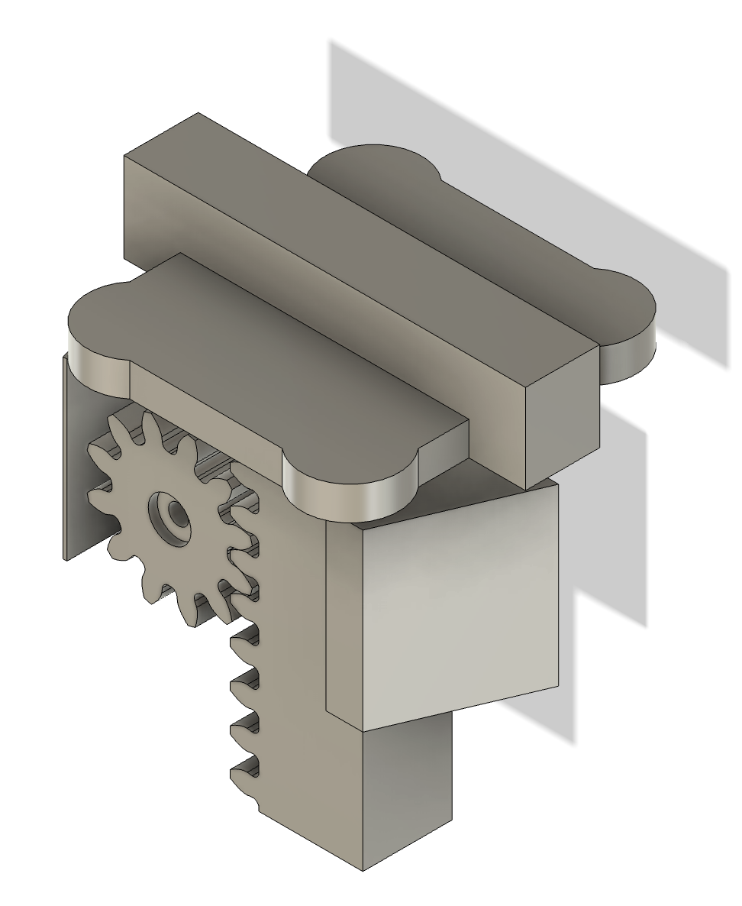

# Three Point Bending Device

This repository include the instructions to build a simple and affordable three point bending test machine for assessing the stiffness of a wrist exoskeleton.

  <figure style="display:inline-block; text-align:center; margin:10px;">
    
    <figcaption>(a) Base setup</figcaption>
  </figure>
  <figure style="display:inline-block; text-align:center; margin:10px;">
    
    <figcaption>(b) Load cell setup</figcaption>
  </figure>

## Required Tools and Component
- A 3D printer (FDM was used)
- Caliper
- MG996R Servo Motor
- [Four Strain-Gauge Sensors and HX711 Module](https://www.amazon.co.uk/YOUMILE-110lbs-Half-bridge-Weight-Resistance/dp/B07TWLP3X8)  

## 
